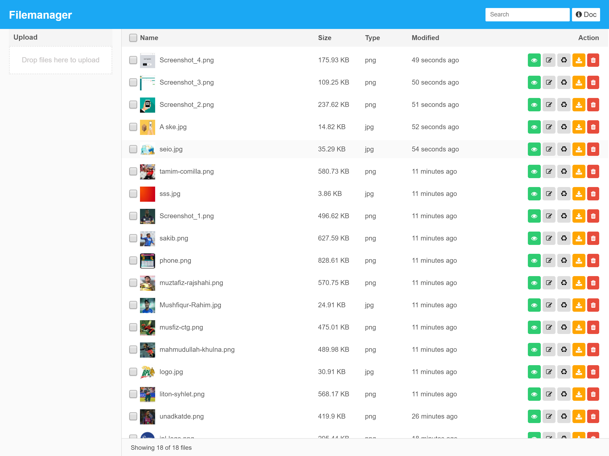

<h1 align="center">Laravel Simple Filemanager</h1>

    
     
    
    

A simple filemanager for Laravel Framework

## Features
- Multi-Language support (English, বাংলা, हिन्दी, العربية, German, Indonesian, 日本語).
- Popular Editor Support: TinyMCE 4, TinyMCE 5, CKEditor, Summernote
- Clean & fresh responsive UI
- Easy to install
- Configurable middleware
- Configurable route
- Drag and drop file upload
- Single/Multiple file upload
- Single file selection
- Batch file selection
- Convert image format
- Batch file delete
- File rename
- Quick file search
- File download
- Event listener
- and more

## Licence

#### Commercial license
If you want to use it to develop commercial sites, themes, projects, and applications, the Commercial license is the appropriate license. With this option, your source code is kept proprietary. To purchase a commercial license you need to buy a licence from the owner. [Contact for licence](https://laravelarticle.com/page/contact)
- **$50** - 1 Developer
- **$150** - Team (Upto 8 developers)
- **$350** - Organization (Unlimited Developers)

#### Open-source license
Free for personal blog and non-commercial usages. If you are creating an open-source application then use it by following the [CC BY-NC 4.0](https://creativecommons.org/licenses/by-nc/4.0/) licence rules.

## Documentation
Get full documentation of [Laravel Simple Filemanager](https://laravelarticle.com/laravel-simple-filemanager)

## Changelog
v1.0.2
- TinyMCE 5 support added

